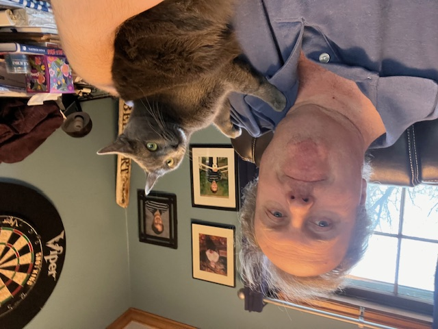

# 432 Class 01: 2025-01-14

[Main Website](https://thomaselove.github.io/432-2025/) | [Calendar](https://thomaselove.github.io/432-2025/calendar.html) | [Syllabus](https://thomaselove.github.io/432-syllabus-2025/) | [Notes](https://thomaselove.github.io/432-notes/) | [Contact Us](https://thomaselove.github.io/432-2025/contact.html) | [Canvas](https://canvas.case.edu) | [Data and Code](https://github.com/THOMASELOVE/432-data) | [Sources](https://github.com/THOMASELOVE/432-classes-2024/tree/main/sources)
:-----------: | :--------------: | :----------: | :---------: | :-------------: | :-----------: | :------------: |:------:
for everything | for deadlines | expectations | from Dr. Love | ways to get help | lab submission | for downloads | to read

## Today's Slides

Class | Date | HTML | Word | Quarto .qmd | Recording
:---: | :--------: | :------: | :------: | :------: | :-------------:
01 | 2025-01-14 | **[Slides 01](https://thomaselove.github.io/432-slides-2025/slides01.html)** | **[Word 01](https://thomaselove.github.io/432-slides-2025/slides01w.docx)** | **[Code 01](https://github.com/THOMASELOVE/432-slides-2025/blob/main/slides01.qmd)** | Visit [Canvas](https://canvas.case.edu/), select **Zoom** and **Cloud Recordings**

- The HTML link provides the (RevealJS) version of the slides that I suggest you focus on during class.
- The Word link will let you download the material in the slides as a Word (.docx) document.
    - Some people prefer this to the HTML version for live note-taking.
- The Quarto file link provides the code I used (in [Quarto](https://quarto.org/)) to build the slides. Hit the download button after clicking the link above if you want the `.qmd` file.
- To print RevealJS slides **to pdf**, [follow these instructions](https://quarto.org/docs/presentations/revealjs/presenting.html#print-to-pdf) using Google Chrome as your browser.
- We attempt to record **every** 432 class via Zoom and post the recording to Canvas, but there have occasionally been problems in the past.

---

## Announcements
 
You can do this. It's a lot of work, but it's worth it.

---

## Getting Help

If you’ve spent 15 minutes working on something and are stuck, don’t keep working on it. ASK FOR HELP. To get help in this course, you have three main options:

### Campuswire discussion forum is open 24/7

Our [Campuswire discussion forum](https://campuswire.com/) is now open 24 hours a day, 7 days a week, and is a great place to ask (and answer) questions. In fact, there's a poll up there now! The system is highly catered to getting you help fast and efficiently from classmates, the TAs, and myself. Rather than emailing questions to the teaching staff, I encourage you to post your questions on Campuswire. If you’re new to Campuswire, sign up via the email you received from me at your CWRU email. If you can't find the email, email me at `thomas dot love` at `case dot edu`, and I'll send another.

### TA Office Hours will start Friday 2025-01-17

Attend TA office hours to get one-on-one help or share a computer problem. TA office hours are held via Zoom, and will begin on Friday 2025-01-17, and continue through Tuesday 2025-04-22, except for Martin Luther King Day (Monday 2025-01-20) and Spring Break (hours are cancelled from 2025-03-08 through 2025-03-14.) 

Zoom information to join these sessions is posted to our Shared Google Drive. TA office hours will be held over Zoom according to the following schedule:

Day	| Time(s)
:---------: | :-------------------------------------------------------------
Fridays | 	12:15 to 1:45 PM
Sundays	| 6 to 7:30 PM and 8:30 to 10 PM
Mondays	| 11:30 AM to 1 PM and 7:30 to 9 PM and 9 to 10:30 PM
Tuesdays | 	11:15 AM to 12:45 PM and 6 to 7:30 PM and 9 to 10:30 PM

(*note*: virtually all assignments for this course are due on Wednesdays at noon.

### If all else fails...

Email Professor Love at `thomas dot love` at `case dot edu` with any individual concerns related to the course that you do not feel comfortable asking elsewhere, or if you have any special concerns or needs that you want him to know about, or to set up an appointment with him for a Zoom meeting. I will also hold “drop in” hours for as long as necessary after each class. Just let me know that you want to talk with me at the end of class.

---

## References from Today's Slides

- Course Mechanics
    - [Main Website](https://thomaselove.github.io/432-2025/), [Calendar](https://thomaselove.github.io/432-2025/calendar.html), [Syllabus](https://thomaselove.github.io/432-syllabus-2025/), [Course Notes](https://thomaselove.github.io/432-notes/)
    - [Software](https://thomaselove.github.io/432-2025/software.html) ([Updating/Installing R & RStudio](https://thomaselove.github.io/432-2025/software.html#installing-r-and-rstudio), necessary [R Packages](https://thomaselove.github.io/432-2025/software.html#r-packages-to-install))
    - Get Data (and Code, Quarto templates) at our [432-data page](https://github.com/THOMASELOVE/432-data)
    - Assignments (including instructions for [Labs](https://thomaselove.github.io/432-2025/lab1.html), [Projects](https://thomaselove.github.io/432-2025/projA.html)) and [Quizzes](https://thomaselove.github.io/432-2025/quiz1.html), deadlines in [Calendar](https://thomaselove.github.io/432-2025/calendar.html)
    - [Sources](https://github.com/THOMASELOVE/432-sources) (books, articles, videos, etc.)
    - Key Links (including [Canvas](https://canvas.case.edu/), [Campuswire](https://campuswire.com/), Shared Google Drive.
    - [Contact Us](https://thomaselove.github.io/432-2025/contact.html) (Campuswire + TA office hours and `Thomas` dot `Love` at `case` dot `edu`)
- Why I Write Dates the Way I Do
    - [XKCD: Public Service Announcement](https://xkcd.com/1179/)
    - Some more [from Wikipedia on ISO 8601](https://en.wikipedia.org/wiki/ISO_8601)
- Data Organization in Spreadsheets 
    - Karl W. Broman & Kara H. Woo (2018) [Data Organization in Spreadsheets]([pdf/Broman_and_Woo_2018_Data_Organization_in_Spreadsheets.pdf](https://github.com/THOMASELOVE/432-sources/pdf/Broman_and_Woo_2018_Data_Organization_in_Spreadsheets.pdf)), *The American Statistician*, 72:1, 2-10, DOI: [10.1080/00031305.2017.1375989](https://doi.org/10.1080/00031305.2017.1375989)
    - [Tidy Data by Hadley Wickham](https://www.jstatsoft.org/article/view/v059i10) in *J of Statistical Software*
    - [R for Data Science, 2nd edition](https://r4ds.hadley.nz/)
    - [How to Share Data with a Statistician](https://github.com/jtleek/datasharing) by Jeff Leek
    - Shannon Ellis and Jeff Leek [How to Share Data for Collaboration (pdf)](https://peerj.com/preprints/3139v5.pdf)
- Naming Things and Getting Organized
    - [XKCD: Documents](https://xkcd.com/1459/)
    - Jenny Bryan's slides on [Naming Things (pdf)](http://www2.stat.duke.edu/~rcs46/lectures_2015/01-markdown-git/slides/naming-slides/naming-slides.pdf), or at [Slideshare](https://www.slideshare.net/milkers/naming-things), or at [SpeakerDeck](https://speakerdeck.com/jennybc/how-to-name-files)
    - Jenny's [Golden Rule of Naming Files and Other Things tweet](https://twitter.com/jennybryan/status/807805087544328192?lang=en)
    - [Project-oriented workflow](https://www.tidyverse.org/blog/2017/12/workflow-vs-script/) from Jenny Bryan
    - The "Version Control" cartoon comes from [Geek and Poke](https://geek-and-poke.com/)
    - [Good Enough Practices in Scientific Computing](http://bit.ly/good-enuff)
- Switching from R Markdown to Quarto
    - I've gathered resources for helping with this transition [on our Sources page](https://github.com/THOMASELOVE/432-sources).
    - Virtually any code you have written in R Markdown can be run using Quarto instead, by simply switching the file extension from .Rmd to .qmd.
    - It's still worth it to learn about how Quarto works, and why it differs from R Markdown when it does.
- Building and Validating Linear Prediction Models
    - See the [431 Course Notes](https://thomaselove.github.io/431-book/), as well as the [432 Course Notes](https://thomaselove.github.io/432-notes/). Both will remain online until 2025-06-01.

---

## What Should I Be Working On?

### By Wednesday 2025-01-15 at Noon:

1. Get officially registered (SIS) for the right flavor of the course (PQHS 432, CRSP 432 or MPHP 432) if you're not already.
2. Complete the Welcome to 432 survey at <https://bit.ly/432-2025-welcome-survey>.
    - Thanks to those of you who've already done this.
3. Accept your invitation to [Campuswire](https://campuswire.com/) (see your email or just look at your existing account). There's a poll up there at the moment (closes Wednesday at noon.)

### Before our next class Thursday 2025-01-16 at 1 PM

1. Review the [website](https://thomaselove.github.io/432-2025/) and [Calendar](https://thomaselove.github.io/432-2025/calendar.html), and skim the [Syllabus](https://thomaselove.github.io/432-syllabus-2025/) and [Course Notes](https://thomaselove.github.io/432-notes/).
2. Buy Jeff Leek's [How to be a Modern Scientist](https://leanpub.com/modernscientist) (then read this little book by the end of January - it should take ~ 4 hours.)
3. Get started [installing or updating your R and RStudio](https://thomaselove.github.io/432-2025/software.html) and install the [necessary R Packages](https://thomaselove.github.io/432-2025/software.html#r-packages-to-install) and [data/code from 432-Data](https://github.com/THOMASELOVE/432-data).
4. Get started on [Lab 1](https://thomaselove.github.io/432-2025/lab1.html), which is due when the [Calendar](https://thomaselove.github.io/432-2025/calendar.html) says it is. The "431 Review" Chapters from the [432 Course Notes](https://thomaselove.github.io/432-notes/) should be helpful.

---

# One Last Thing

I don't know whether our cat, Josephine, will join us during class today, or not, but here's a picture. Our other cat, Fuzzington, passed away just after Christmas. It was his time.

