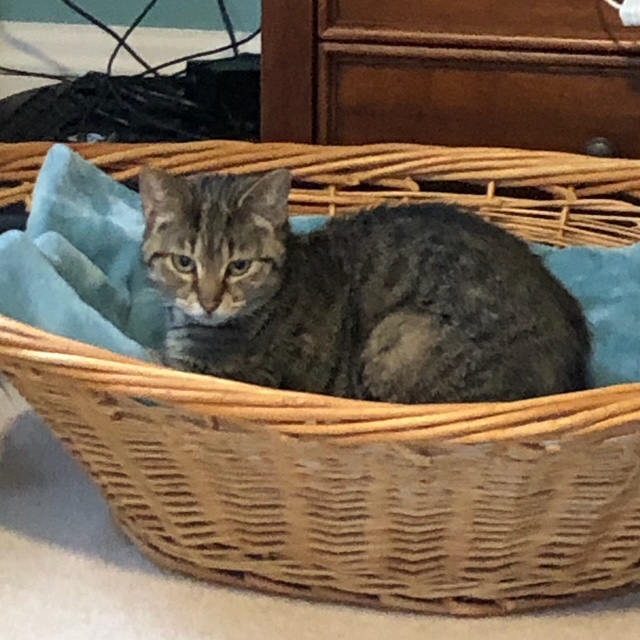

# 432 Class 07: 2025-02-04

[Main Website](https://thomaselove.github.io/432-2025/) | [Calendar](https://thomaselove.github.io/432-2025/calendar.html) | [Syllabus](https://thomaselove.github.io/432-syllabus-2025/) | [Notes](https://thomaselove.github.io/432-notes/) | [Contact Us](https://thomaselove.github.io/432-2025/contact.html) | [Canvas](https://canvas.case.edu) | [Data and Code](https://github.com/THOMASELOVE/432-data) | [Sources](https://github.com/THOMASELOVE/432-classes-2024/tree/main/sources)
:-----------: | :--------------: | :----------: | :---------: | :-------------: | :-----------: | :------------: |:------:
for everything | for deadlines | expectations | from Dr. Love | ways to get help | lab submission | for downloads | to read

## Today's Slides

Class | Date | HTML | Word | Quarto .qmd | Recording
:---: | :--------: | :------: | :------: | :------: | :-------------:
07 | 2025-02-04 | **[Slides 07](https://thomaselove.github.io/432-slides-2025/slides07.html)** | **[Word 07](https://thomaselove.github.io/432-slides-2025/slides07w.docx)** | **[Code 07](https://github.com/THOMASELOVE/432-slides-2025/blob/main/slides07.qmd)** | Visit [Canvas](https://canvas.case.edu/), select **Zoom** and **Cloud Recordings**

---

## Announcements

1. I am sorry about the recent removal of many important data sets from federal sites.
    - My fury about this and many other actions of this administration is substantial, but I'll spare you that.
    - Those of you who are scared (which I assume is all of you) about what the current presidential administration is doing, or the direction of the world in general, I understand and empathize.
    - I encourage you not to miss opportunities to take meaningful action in your life and career, and spare some time to comfort others instead of being overwhelmed by worry when no one really knows yet how any of this will shake out.
    - Like it or not, we live in very interesting times. Good luck to all of you.
2. In Project A, if your linear regression outcome has at least 400 observed (i.e. non-missing) values, and if your logistic regression outcome has at least 200 observed values in the group you're calling "1" and 200 more in the group you're calling "0", then I'm not going to be meaningfully concerned about your sample size.
    - If your outcomes don't meet these standards, I **might** be meaningfully concerned about your sample size, but I might not.
3. The Project A plan is due at noon Wednesday 2025-02-05 to [Canvas](https://canvas.case.edu/). Please make that deadline.

## One Last Thing

We rescued another cat this weekend. Her name is Rosie, short for [Rose Maybud](https://en.wikipedia.org/wiki/Ruddigore). We hope she and Josie will eventually become friends, but it will take a while.

