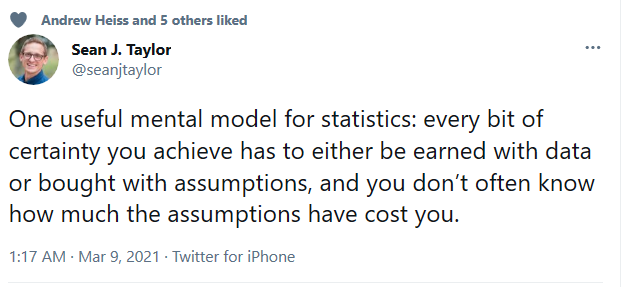

# 432 Class 15: 2025-03-04

[Main Website](https://thomaselove.github.io/432-2025/) | [Calendar](https://thomaselove.github.io/432-2025/calendar.html) | [Syllabus](https://thomaselove.github.io/432-syllabus-2025/) | [Notes](https://thomaselove.github.io/432-notes/) | [Contact Us](https://thomaselove.github.io/432-2025/contact.html) | [Canvas](https://canvas.case.edu) | [Data and Code](https://github.com/THOMASELOVE/432-data) | [Sources](https://github.com/THOMASELOVE/432-classes-2024/tree/main/sources)
:-----------: | :--------------: | :----------: | :---------: | :-------------: | :-----------: | :------------: |:------:
for everything | for deadlines | expectations | from Dr. Love | ways to get help | lab submission | for downloads | to read

## Today's Slides

Class | Date | HTML | Word | Quarto .qmd | Recording
:---: | :--------: | :------: | :------: | :------: | :-------------:
15 | 2025-03-04 | **[Slides 15](https://thomaselove.github.io/432-slides-2025/slides15.html)** | **[Word 15](https://thomaselove.github.io/432-slides-2025/slides15w.docx)** | **[Code 15](https://github.com/THOMASELOVE/432-slides-2025/blob/main/slides15.qmd)** | Visit [Canvas](https://canvas.case.edu/), select **Zoom** and **Cloud Recordings**

---

## Announcements

1. To register or learn more about the Joint Biostatistics Symposium to be held on 2025-04-07 from 10:30 AM to 4 PM at CWRU, visit <https://bioscinema.github.io/biostatsymposium/>. Jeff Leek is the [keynote speaker](https://bioscinema.github.io/biostatsymposium/#keynote-speaker).
2. The [Demonstration for Project A](https://thomaselove.github.io/432-2025/432_projectA_demo.html) hows the minimum requirements for a low B grade on the project. The main things that are missing in the Demonstration are careful interpretations and explanations of some of the ideas, results and code. You need to include those pieces in order to move from a low B to some sort of A grade. In addition, the Demonstration does not include the optional extra sections 8.9 and 9.7.
3. Remember that your [Quiz 1](https://thomaselove.github.io/432-2025/quiz1.html) answers on the Google Form must be submitted by noon tomorrow (Wednesday 2025-03-05). Technically, the form will close at 1 PM, and won't re-open. Thank you, and good luck!
    - Please check the [Quiz 1 page](https://thomaselove.github.io/432-2025/quiz1.html) and your email to see if Dr. Love has provided any changes or clarifications to the Quiz before making your final submission.
    - If I don't address a question about Quiz 1 that you have today, you can email me about it any time before 9 AM tomorrow and I'll try to help.
4. Today's Agenda: (1) Discuss time-to-event (survival) data (see slides) (2) Ask Me Anything session about Quiz 1.

---

## Spring Break

1. Spring Break is next week, and we will not have class on either 2025-03-09 or 2025-03-11.
2. Dr. Love will be away and unresponsive to emails and Campuswire from 2025-03-07 through 2025-03-14.
3. The TAs will not hold office hours from 2025-03-08 through 2025-03-14.
4. The [Project A Portfolio](https://thomaselove.github.io/432-2025/projA.html#the-project-a-portfolio) is due to Canvas at noon on 2025-03-19. Get your questions in before we disappear for Break, if possible.
    - Remember the Portfolio includes a complete Quarto file, complete HTML file, complete tidied R data set file, and (up to 4 minute) video file.

---

## Sources related to Today's Slides

- The survival package: Reference Manual (pdf) is [here](https://cran.r-project.org/web/packages/survival/survival.pdf), while the website is  <https://github.com/therneau/survival>.
- The survminer package: <https://rpkgs.datanovia.com/survminer/index.html>
- My [course notes chapter on Time-to-Event / Survival Data](https://thomaselove.github.io/432-notes/survival_data.html)

---
## Today in "How To Be A Modern Scientist"

### On Internal Scientific Communication

- Use a tool that will let you manage groups
- Open separate discussions for each project
- Summarize at regular intervals
- Include a thread for literature curation

### On Books

- Think shorter
- Develop a book on a platform that allows feedback
- Sell your book on multiple online platforms

---

## Today's Excerpt from "[Moving to a World Beyond 'p < 0.05'](https://github.com/THOMASELOVE/432-sources/blob/main/pdf/ASA_2019_A_World_Beyond.pdf)"

from **Don't say "Statistically Significant"**

... And so the tool has become the tyrant. The problem is not simply use of the word "significant," although the statistical and ordinary language meanings of the word are indeed now hopelessly confused; the term should be avoided for that reason alone. 

The problem is a larger one, however: using bright-line rules for justifying scientific claims or conclusions can lead to erroneous beliefs and poor decision making ([ASA 2016 statement](https://github.com/THOMASELOVE/432-sources/blob/main/pdf/ASA_2016_Pvalues_Context_Process_Purpose.pdf), Principle 3). 

A label of statistical significance adds nothing to what is already conveyed by the value of p; in fact, this dichotomization of p-values makes matters worse.

For example, no p-value can reveal the plausibility, presence, truth, or importance of an association or effect. Therefore, a label of statistical significance does not mean or imply that an association or effect is highly probable, real, true, or important. Nor does a label of statistical nonsignificance lead to the association or effect being improbable, absent, false, or unimportant.

Yet the dichotomization into "significant" and "not significant" is taken as an imprimatur of authority on these characteristics....

As Gelman and Stern (2006) famously observed, the difference between "significant" and "not significant" is not itself statistically significant.

