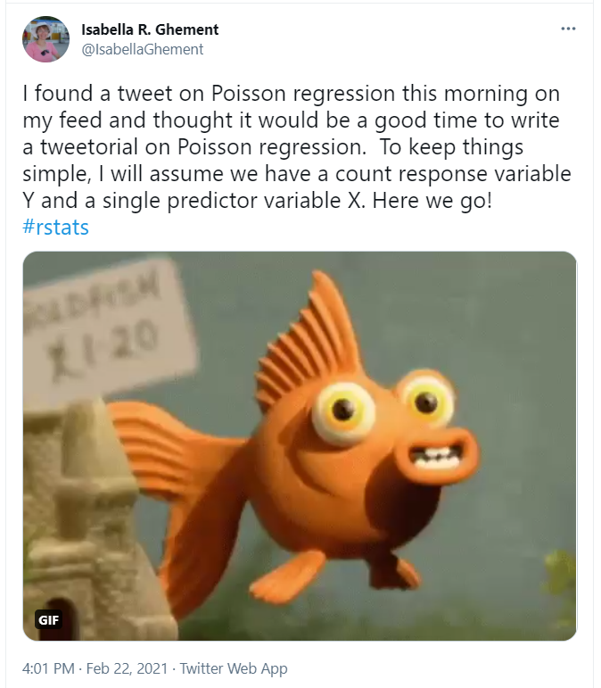

# 432 Class 17: 2025-03-18

[Main Website](https://thomaselove.github.io/432-2025/) | [Calendar](https://thomaselove.github.io/432-2025/calendar.html) | [Syllabus](https://thomaselove.github.io/432-syllabus-2025/) | [Notes](https://thomaselove.github.io/432-notes/) | [Contact Us](https://thomaselove.github.io/432-2025/contact.html) | [Canvas](https://canvas.case.edu) | [Data and Code](https://github.com/THOMASELOVE/432-data) | [Sources](https://github.com/THOMASELOVE/432-classes-2024/tree/main/sources)
:-----------: | :--------------: | :----------: | :---------: | :-------------: | :-----------: | :------------: |:------:
for everything | for deadlines | expectations | from Dr. Love | ways to get help | lab submission | for downloads | to read

## Today's Slides

Class | Date | HTML | Word | Quarto .qmd | Recording
:---: | :--------: | :------: | :------: | :------: | :-------------:
17 | 2025-03-18 | **[Slides 17](https://thomaselove.github.io/432-slides-2025/slides17.html)** | **[Word 17](https://thomaselove.github.io/432-slides-2025/slides17w.docx)** | **[Code 17](https://github.com/THOMASELOVE/432-slides-2025/blob/main/slides17.qmd)** | Visit [Canvas](https://canvas.case.edu/), select **Zoom** and **Cloud Recordings**

---

## Announcements

To come.

## Regression on Count Outcomes

This week, we'll be presenting some key ideas on fitting models for count outcomes. Counts are discrete (rather than continuous) and counts are typically integers (0, 1, 2, 3 and so on) and cannot be made more precise. Relevant materials are available in Chapters 24-26 of the [Course Notes](https://thomaselove.github.io/432-notes/). 

Methods we will touch on this week include Poisson regression and negative binomial regression, along with augmentations of these two approaches to inflate the number of zeros predicted, and also "hurdle" versions which specify one process for zero counts and another for positive counts. In Chapters 24-26, we discuss all of these, as well as another approach, called a tobit (or censored) regression model.

Here's [a link to the start of the "tweetorial"](https://twitter.com/IsabellaGhement/status/1363957122787024901) on some key practical aspects of understanding Poisson regression models.

- For more on rootograms, check out Kleiber C Zeileis A [Visualizing Count Data Regressions Using Rootograms](rootograms_2016.pdf) from *The American Statistician* 2016.
- For more on Vuong's test, check out Vuong, QH (1989) Likelihood ratio tests for model selection and non-nested hypotheses. *Econometrica*, 57:307-333.

## From Today's Slides

- [Interpreting Log Transformations](https://library.virginia.edu/data/articles/interpreting-log-transformations-in-a-linear-model).

## Why I use `read_csv()` all the time, and never use `read.csv()` anymore

1. `read_csv()` is much faster than `read.csv()`, 
2. `read_csv()` provides a progress meter and a compact method for specifying column types,
3. `read_csv()` will read compressed files automatically,
4. `read_csv()` automatically creates a tibble, and
5. `read_csv()` allows me to speed the process of debugging by providing much more useful error messages about which rows are problematic, especially when the error is non-fatal.

- For more details, see the [Data import section of R for Data Science](https://r4ds.hadley.nz/data-import.html).
- From Josh Gonzales at Medium: [read_csv(): The Best Way to import CSV data into R](https://medium.com/r-tutorials/r-functions-daily-read-csv-3c418c25cba4)

