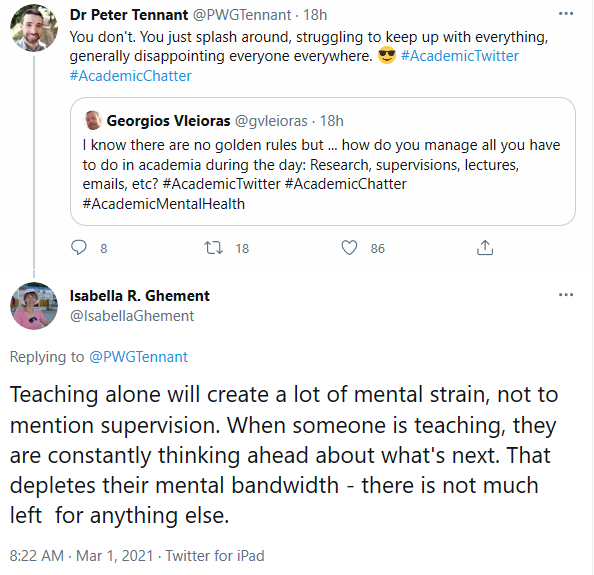

# 432 Class 23: 2025-04-08

[Main Website](https://thomaselove.github.io/432-2025/) | [Calendar](https://thomaselove.github.io/432-2025/calendar.html) | [Syllabus](https://thomaselove.github.io/432-syllabus-2025/) | [Notes](https://thomaselove.github.io/432-notes/) | [Contact Us](https://thomaselove.github.io/432-2025/contact.html) | [Canvas](https://canvas.case.edu) | [Data and Code](https://github.com/THOMASELOVE/432-data) | [Sources](https://github.com/THOMASELOVE/432-classes-2024/tree/main/sources)
:-----------: | :--------------: | :----------: | :---------: | :-------------: | :-----------: | :------------: |:------:
for everything | for deadlines | expectations | from Dr. Love | ways to get help | lab submission | for downloads | to read

## Today's Slides

Class | Date | HTML | Word | Quarto .qmd | Recording
:---: | :--------: | :------: | :------: | :------: | :-------------:
23 | 2025-04-08 | **[Slides 23](https://thomaselove.github.io/432-slides-2025/slides23.html)** | **[Word 23](https://thomaselove.github.io/432-slides-2025/slides23w.docx)** | **[Code 23](https://github.com/THOMASELOVE/432-slides-2025/blob/main/slides23.qmd)** | Visit [Canvas](https://canvas.case.edu/), select **Zoom** and **Cloud Recordings**

---

 [Source: XKCD](https://xkcd.com/2610/)

## Announcements

1. Sorry about switching today's class to Zoom, but I don't want to help people get sick. We'll be in person again on Thursday.
2. There is a [Minute Paper after Class 23](https://bit.ly/432-2025-min-23), due at noon tomorrow (2025-04-09) - please visit <https://bit.ly/432-2025-min-23> to complete it.
    - You'll need to log into Google via CWRU to be able to complete the form.
    - It shouldn't take you more than a few minutes to do, and completing the form on time will result in a slight improvement to your course grade. 
3. As of noon today, I have approved all but one of the Project B Plans (and all but two of the Project B titles.)
    - See my email response sent this morning to those of you who submitted a revision.
    - Please check [the schedule posted here](https://github.com/THOMASELOVE/432-classes-2025/blob/main/projectB/README.md) to ensure I have the right title, time and date for your presentation.
4. Here is a useful [checklist for data graphics](https://statmodeling.stat.columbia.edu/2022/03/15/a-checklist-for-data-graphics/) from Christian Hennig, as posted by Andrew Gelman, with a few comments.

## Agenda

- Using `coxph()` and then `cph()` from the **rms** package to estimate and assess Cox proportional hazards regression models

## Sources

- Rossi's recidivism data [are described here](https://rdrr.io/cran/carData/man/Rossi.html), as well as many other places.
- These data are also the main example in John Fox and Sanford Weisberg's [Cox Proportional-Hazards Regression for Survival Data in R](https://www.john-fox.ca/Companion/appendices/Appendix-Cox-Regression.pdf) (pdf) which describes the basis for the Cox model in more detail than I will today, and also explains how to use the **survival** package in R to estimate Cox regressions.
- Frank Harrell's website at <https://hbiostat.org/r/rms/> includes links to [this video](https://www.youtube.com/watch?v=EoIB_Obddrk) demonstrating some interactive survival curves.

## A few thoughts on the adjusted R-square statistic

In linear regression work, the "adjusted R-square" statistic attempts to use the same data to fit the model and evaluate it, through applying a penalty based on the number of coefficient estimates that need to be developed and the sample size. This summary is somewhat interesting, and has some value occasionally. However, I usually avoid placing much weight on the summary statistic "adjusted R-square" to describe the predictive quality of a model, in favor of a validated R-square statistic, which might include:

- the "optimism-corrected" results of a bootstrap validation (as in `validate` for an `ols` fit)
- the r-square value observed when applying a model fit in a training sample to holdout data in a test sample
- some other cross-validated r-square statistic, as can be developed using the `rsample` and `yardstick` packages (see, for example, Chapters 9 and 10 in [Tidy Modeling with R](https://www.tmwr.org/).

So my main point is that I wouldn't use adjusted R-square much (if at all) in linear regression, instead using a better method to assess predictive power in linear regression.

----

## Remaining Tasks for 432

1. There is a Minute Paper after Class 23, due at noon **tomorrow** (2025-04-09) - please visit <https://bit.ly/432-2025-min-23> to fill out the form.
2. [Lab 7](https://thomaselove.github.io/432-2025/lab7.html) is also due at noon **tomorrow** Wednesday 2025-04-09.
    - After today's class you should be able to finish this.
3. If you haven't yet completed [Lab 6](https://thomaselove.github.io/432-2025/lab6.html) (see list of students [here](https://github.com/THOMASELOVE/432-classes-2025/tree/main/lab6#no-submission-yet)), you have until Tuesday 2025-04-15 at 5 PM to do so.
4. If you have questions about your Project A grade, you have until Tuesday 2025-04-15 at 5 PM to email me about that.
5. [Project B presentations](https://thomaselove.github.io/432-2025/projB.html#the-presentation) are scheduled April 17-23 (see [the schedule here](https://github.com/THOMASELOVE/432-classes-2025/tree/main/projectB).) Also, see the **432 Project B Plan Feedback for Spring 2025** document in the **Project B Plan Feedback** folder in our Shared Google Drive for my comments on your Plan.
6. [Quiz 2](https://thomaselove.github.io/432-2025/quiz2.html) will come to you on Friday 2025-04-18 and is due at noon Friday 2025-04-25.
7. [Lab Regrade Request form](https://bit.ly/432-2025-lab-regrades) (optional) is now available at <https://bit.ly/432-2025-lab-regrades>, and is due on 2025-04-25 (same day as Quiz 2). See [Section 8.5 of our Syllabus](https://thomaselove.github.io/432-syllabus-2025/08-grading.html) for more on this.
8. [Project B portfolio](https://thomaselove.github.io/432-2025/projB.html#the-project-portfolio) due at noon 2025-04-30
9. Course Evaluation at <https://webapps.case.edu/courseevals/> should be done anytime after you present your project, and is due when CWRU tells you it is, usually in early May. Please do fill this out. It delights me every year when we get 100% participation.

## One Last Thing

