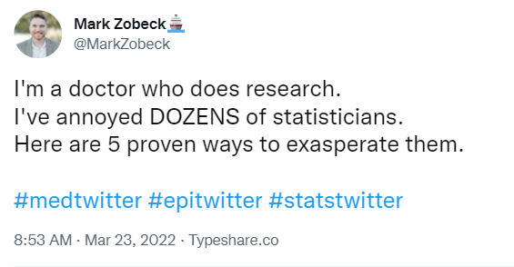

# 432 Class 27: 2025-04-24

[Main Website](https://thomaselove.github.io/432-2025/) | [Calendar](https://thomaselove.github.io/432-2025/calendar.html) | [Syllabus](https://thomaselove.github.io/432-syllabus-2025/) | [Notes](https://thomaselove.github.io/432-notes/) | [Contact Us](https://thomaselove.github.io/432-2025/contact.html) | [Canvas](https://canvas.case.edu) | [Data and Code](https://github.com/THOMASELOVE/432-data) | [Sources](https://github.com/THOMASELOVE/432-classes-2024/tree/main/sources)
:-----------: | :--------------: | :----------: | :---------: | :-------------: | :-----------: | :------------: |:------:
for everything | for deadlines | expectations | from Dr. Love | ways to get help | lab submission | for downloads | to read

## Today's Slides

Class | Date | HTML | Word | Quarto .qmd | Recording
:---: | :--------: | :------: | :------: | :------: | :-------------:
27 | 2025-04-24 | **[Slides 27](https://thomaselove.github.io/432-slides-2025/slides27.html)** | **[Word 27](https://thomaselove.github.io/432-slides-2025/slides27w.docx)** | **[Code 27](https://github.com/THOMASELOVE/432-slides-2025/blob/main/slides27.qmd)** | Visit [Canvas](https://canvas.case.edu/), select **Zoom** and **Cloud Recordings**

---

## Agenda

- Building and Assessing Statistical Work in 2025
- Maintaining and Enhancing What You've Learned
- Your Questions, My Answers on Quiz 2, Project B and anything else...

## Project B Presentations

- All of the presentations are done. Thank you for your effort and for being on time for your presentations and being well-prepared, which let me get through this with a minimum of pain. I really appreciate it.
- The range of presentation grades was **71** to **97**.
- You should have an email from me with my comments on your presentation.
    - The scale for the "Rate these concerns" questions was Excellent/Good/Acceptable/Needs Improvement.
    - The scale for the items that followed those questions was Yes/Somewhat/No, although sometimes I used a different phrase (like "Not Quite" or "Mostly") to indicate "Somewhat".
- Several of the presentations were outstanding, and I have shared some of those slides from those presentations with you on our Shared Drive in the **Some Sample Project B Slides** folder.
    - Note that I have deleted the recordings for all of the Project B presentations.
- My method for calculating your eventual Project B grade is found in the **How Will I estimate your grade in 432? (Spring 2025)** document on our Shared Google Drive.

## Announcements

1. TA office hours have ended for the semester. Many thanks to the TAs for their exceptional efforts. [Campuswire](https://campuswire.com/) will remain open until noon on Wednesday 2025-04-30.
2. If you want me to review the grade on any Lab this semester, fill out the (optional) [Lab Regrade Request form](https://bit.ly/432-2025-lab-regrades) by Friday 2025-04-25 at noon.
    - See [Section 8.5 of our Syllabus](https://thomaselove.github.io/432-syllabus-2025/08-grading.html) for more on this.
3. [R version 4.5.0](https://cran.case.edu/) is now available! The current production version of RStudio is `2024.12.1+563` released `2025-02-13`.
4. [Quiz 2](https://thomaselove.github.io/432-2025/quiz2.html) is due Monday 2025-04-28 at 9 AM. The [Google Form](https://bit.ly/432-2025-quiz2-form) will close at 9:30 AM on Monday and will not re-open, so do not wait until the last minute.
    - I will address any Quiz 2 questions you have at the end of today's class.
    - I remind you all to look at [the Quiz 2 page](https://thomaselove.github.io/432-2025/quiz2.html) for details on revisions to the PDF file since its initial posting.
    - Here are three hints for the Quiz:
        - In **Question 9**, if one of the indicator variables for a multi-categorical predictor is included in the "best subsets" result, include the entire multi-categorical predictor in the model you select.
        - A correct answer to **Question 10** includes the data from subject `H012304`, who is in the 172nd row of the `data3` tibble.
        - In **Question 12**, I will be looking to see that you accurately describe the meaning of both the point estimate and the 99% confidence interval. As noted, an excellent answer will show that you've reviewed the description of the variables contained in `data4`.
5. The [Project B portfolio](https://thomaselove.github.io/432-2025/projB.html#the-project-portfolio) is due to Canvas on Wednesday 2025-04-30 at Noon.
    - A complete portfolio submission includes four things: (1) your .qmd file, (2) the resulting .html file, (3) the slides **exactly as you used them in your presentation** (most people used slides, a few will send their presented .html), and (4) your R data set.
    - Those of you using data that cannot be shared with me be sure to submit [what I've asked for in the instructions](https://thomaselove.github.io/432-2025/projB.html#submitting-your-data).
    - If you are working with a partner, one of you supplies the portfolio and the other submits a one-page note to Canvas indicating the members of the partnership and that the partner will submit the work.
    - I have a list of five things I plan to review in each portfolio, since I won't have time to read every part of every portfolio (38 portfolios in a day is more than I can read.) I will read the whole portfolio for anyone on the boundary of an A/B in the class, of course.
        - You can probably guess that two of the five things I will look at are: loading packages properly, and the conclusions/discussion section. I won't specify the other three.
6. Bonus A on [Campuswire](https://campuswire.com/) is also due at noon on Wednesday 2025-04-30. I've reminded you enough on this, I think.
7. After you have completed the **CWRU course evaluation** at <https://webapps.case.edu/courseevals/>, which you can do at any time now, please email me to let me know, and if I receive such an email (please use the subject line **432 course evaluation done**) from you, I will stop pestering you to do it. I had 6 responses as of 2025-04-23 at 12:25 PM.

## Four Interesting post-432 Learning Pathways

1. Frank Harrell's Short Course on Regression Modeling Strategies <https://hbiostat.org/doc/rms/4day.html> given annually (costs money) and his [book on the same subject](https://hbiostat.org/doc/rms/book/) (available online).
2. Richard McIlreath's Statistical Rethinking course <https://github.com/rmcelreath/stat_rethinking_2024> with lectures (from 2023) posted to  YouTube. Bayesian ways of thinking are a major focus here.
3. [Get Started with Tidymodels](https://www.tidymodels.org/start/) is a great place to start learning about tidymodels. The book is [Tidy Modeling with R](https://www.tmwr.org/) by Max Kuhn and Julia Silge.
4. Generalized Additive Models (gams) in R: See [Noam Ross' online (free) short course](https://noamross.github.io/gams-in-r-course/) and Michael Clark's [Generalized Additive Models](https://m-clark.github.io/generalized-additive-models/) and the [gratia package](https://github.com/gavinsimpson/gratia) which provides `ggplot`-based graphics and utility functions for working with generalized additive models (GAMs) fitted using the `mgcv` package.

I have recommended multiple other things on [our Sources page](https://github.com/THOMASELOVE/432-sources).

## When will the 431 and 432 materials disappear from the web?

I don't promise that they will be there after June 1, 2025, but they will stay up until then.

### Setting Up Today's Thoughts...

- [Source (Mark Zobeck's twitter thread)](https://twitter.com/MarkZobeck/status/1506615109170442244)
- The two references in the final image are dead links. Instead, use these:
    - [Statistical Problems to Document and To Avoid](https://discourse.datamethods.org/t/author-checklist/3407)
    - [Glossary of Statistical Terms (from Frank Harrell)](https://hbiostat.org/glossary/)

In addition to these materials, the main topics today come from:

- [A CHecklist for statistical Assessment of Medical Papers (the CHAMP statement): explanation and elaboration](https://bjsm.bmj.com/content/55/18/1009.2)
- [Biostatistical Modeling Plan](https://www.fharrell.com/post/modplan) from Frank Harrell.

---------------------------------

## References and Resources from Today's Slides or Past Versions of Today's Slides

- Jeff T Leek and Roger D Peng "What is the Question" from *Science* 2015-03-20 [pdf is here](https://www.aaas.org/sites/default/files/Stats_What_Question_2015.pdf).
    - Also, see their commentary in *Nature* 2015-03-30 [collected here](https://github.com/THOMASELOVE/432-sources/blob/main/pdf/Leek_and_Peng_2015_Pvalues_Nature.pdf).
    - Carl Howe from RStudio posted (2020-04-22) on "[Getting to the Right Question](https://blog.rstudio.com/2020/04/22/getting-to-the-right-question/)" - an always-critical part of data science work.
- Andrew Gelman blog post for 2023-04-23 ["Hey - here’s some ridiculous evolutionary psychology for you, along with some really bad data analysis."](https://statmodeling.stat.columbia.edu/2023/04/23/hey-heres-some-ridiculous-evolutionary-psychology-for-you-along-with-some-really-bad-data-analysis/)
- John D. Cook blog post for 2023-04-23 ["Can you have confidence in a confidence interval?"](https://www.johndcook.com/blog/2023/04/23/confidence-interval/)
- George Cobb's thoughts on assessment are [available in the PDF here](http://www.rossmanchance.com/artist/proceedings/cobb.pdf).
- [Frank Harrell's 2023-04-22 tweet](https://twitter.com/f2harrell/status/1649882314833313794) about [this preprint](https://papers.ssrn.com/sol3/papers.cfm?abstract_id=4417585) entitled "Interpretation of Wide Confidence Intervals in Meta-Analytic Estimates: Is the 'Absence of Evidence' 'Evidence of Absence'?"
    - The Cochrane Review by Jefferson et al. entitled "Physical interventions to interrupt or reduce the spread of respiratory viruses" [is available here](https://www.cochranelibrary.com/cdsr/doi/10.1002/14651858.CD006207.pub6/full).
    - The statement by Editor-in-Chief Karla Soares-Weiser [can be found here](https://www.cochrane.org/news/statement-physical-interventions-interrupt-or-reduce-spread-respiratory-viruses-review).
    - A NY Times opinion piece by Zeynep Tufecki entitled [Here's Why The Science is Clear that Masks Work](https://www.nytimes.com/2023/03/10/opinion/masks-work-cochrane-study.html) from 2023-03-10 may be of interest, too.

# After the Course is Over

Visit our [end of semester page](https://github.com/THOMASELOVE/432-classes-2025/tree/main/end).
