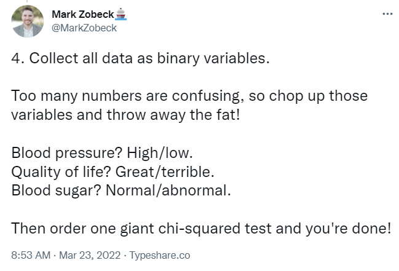
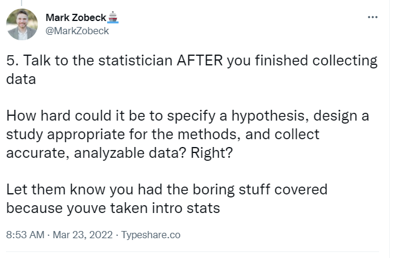
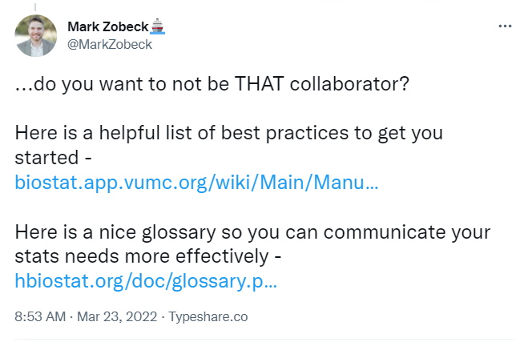

# 432 Class 27: 2025-04-24

[Main Website](https://thomaselove.github.io/432-2025/) | [Calendar](https://thomaselove.github.io/432-2025/calendar.html) | [Syllabus](https://thomaselove.github.io/432-syllabus-2025/) | [Notes](https://thomaselove.github.io/432-notes/) | [Contact Us](https://thomaselove.github.io/432-2025/contact.html) | [Canvas](https://canvas.case.edu) | [Data and Code](https://github.com/THOMASELOVE/432-data) | [Sources](https://github.com/THOMASELOVE/432-classes-2024/tree/main/sources)
:-----------: | :--------------: | :----------: | :---------: | :-------------: | :-----------: | :------------: |:------:
for everything | for deadlines | expectations | from Dr. Love | ways to get help | lab submission | for downloads | to read

## Today's Slides

Class | Date | HTML | Word | Quarto .qmd | Recording
:---: | :--------: | :------: | :------: | :------: | :-------------:
27 | 2025-04-24 | **[Slides 27](https://thomaselove.github.io/432-slides-2025/slides27.html)** | **[Word 27](https://thomaselove.github.io/432-slides-2025/slides27w.docx)** | **[Code 27](https://github.com/THOMASELOVE/432-slides-2025/blob/main/slides27.qmd)** | Visit [Canvas](https://canvas.case.edu/), select **Zoom** and **Cloud Recordings**

---

## Agenda and Announcements

- Building and Assessing Statistical Work in 2025
- Maintaining and Enhancing What You've Learned

## Two Great Courses

- Frank Harrell's Short Course on Regression Modeling Strategies <https://hbiostat.org/doc/rms/4day.html> given annually (costs money) and his [book on the same subject](https://hbiostat.org/doc/rms/book/) (available online).
- Richard McIlreath's Statistical Rethinking course <https://github.com/rmcelreath/stat_rethinking_2024> with lectures (from 2023) posted to  YouTube. Bayesian ways of thinking are a main focus here.

I have recommended multiple other things on [our Sources page](https://github.com/THOMASELOVE/432-sources).

## When will the 431 and 432 materials disappear from the web?

I don't promise that they will be there after June 1, 2025, but they will stay up until then.

### Setting Up Today's Thoughts...

- [Source (Mark Zobeck's twitter thread)](https://twitter.com/MarkZobeck/status/1506615109170442244)
- The two references in the final image are dead links. Instead, use these:
    - [Statistical Problems to Document and To Avoid](https://discourse.datamethods.org/t/author-checklist/3407)
    - [Glossary of Statistical Terms (from Frank Harrell)](https://hbiostat.org/glossary/)

In addition to these materials, the main topics today come from:

- [A CHecklist for statistical Assessment of Medical Papers (the CHAMP statement): explanation and elaboration](https://bjsm.bmj.com/content/55/18/1009.2)
- [Biostatistical Modeling Plan](https://www.fharrell.com/post/modplan) from Frank Harrell.

---------------------------------

## References and Resources from Today's Slides or Past Versions of Today's Slides

- Jeff T Leek and Roger D Peng "What is the Question" from *Science* 2015-03-20 [pdf is here](https://www.aaas.org/sites/default/files/Stats_What_Question_2015.pdf).
    - Also, see their commentary in *Nature* 2015-03-30 [collected here](https://github.com/THOMASELOVE/432-sources/blob/main/pdf/Leek_and_Peng_2015_Pvalues_Nature.pdf).
    - Carl Howe from RStudio posted (2020-04-22) on "[Getting to the Right Question](https://blog.rstudio.com/2020/04/22/getting-to-the-right-question/)" - an always-critical part of data science work.
- Andrew Gelman blog post for 2023-04-23 ["Hey - here’s some ridiculous evolutionary psychology for you, along with some really bad data analysis."](https://statmodeling.stat.columbia.edu/2023/04/23/hey-heres-some-ridiculous-evolutionary-psychology-for-you-along-with-some-really-bad-data-analysis/)
- John D. Cook blog post for 2023-04-23 ["Can you have confidence in a confidence interval?"](https://www.johndcook.com/blog/2023/04/23/confidence-interval/)
- George Cobb's thoughts on assessment are [available in the PDF here](http://www.rossmanchance.com/artist/proceedings/cobb.pdf).
- [Frank Harrell's 2023-04-22 tweet](https://twitter.com/f2harrell/status/1649882314833313794) about [this preprint](https://papers.ssrn.com/sol3/papers.cfm?abstract_id=4417585) entitled "Interpretation of Wide Confidence Intervals in Meta-Analytic Estimates: Is the 'Absence of Evidence' 'Evidence of Absence'?"
    - The Cochrane Review by Jefferson et al. entitled "Physical interventions to interrupt or reduce the spread of respiratory viruses" [is available here](https://www.cochranelibrary.com/cdsr/doi/10.1002/14651858.CD006207.pub6/full).
    - The statement by Editor-in-Chief Karla Soares-Weiser [can be found here](https://www.cochrane.org/news/statement-physical-interventions-interrupt-or-reduce-spread-respiratory-viruses-review).
    - A NY Times opinion piece by Zeynep Tufecki entitled [Here's Why The Science is Clear that Masks Work](https://www.nytimes.com/2023/03/10/opinion/masks-work-cochrane-study.html) from 2023-03-10 may be of interest, too.
